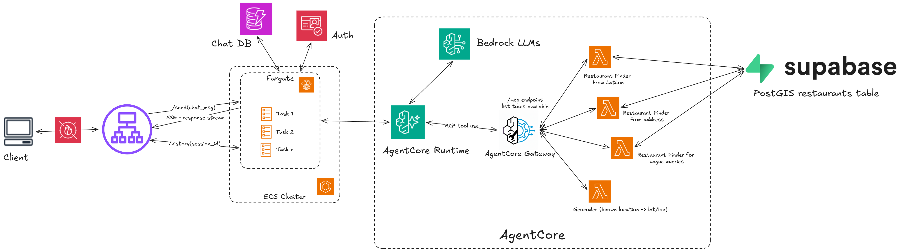

# "Hun Gry" - your NYC food expert

He's alive and running at [hungry.city](https://hungry.city)

- Ask him for restaurant recommendations in the five boroughs of NYC.
- Should have data available from Google Maps- as of May 13th, 2026.

## Final build

[Old plan (cringe)](img/flow.png)

New plan (based):

Use AWS AgentCore, and fargate containers + ALB instead of lambdas.

Some more reasons to why I changed up my plan in [DESIGN.md](DESIGN.md)

Show some ❤️ by ⭐ing this repository! I built this stuff without vibe coding :D (okay I vibe coded the front-end cuz I hate it, but the AWS stuff is all me!)